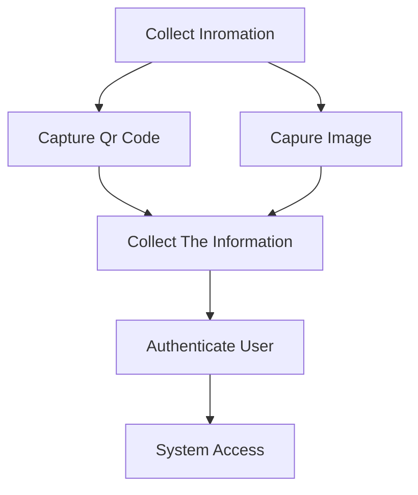

# Face Recognition and QR Code Scanner

This project implements two key functionalities: **Face Recognition** and **QR Code Scanning** to authenticate and grant user access to a system.

## Features

1. **Face Recognition**:  
   The system captures the user's image and sends it to a pre-trained Python model for facial recognition. Based on the comparison of the captured image with stored data, access is granted or denied.

2. **QR Code Scanner**:  
   The QR Code Scanner allows users to scan a QR code, which is processed to verify authenticity and provide access accordingly. The QR code can contain important user or access details and upon successful scanning, access to the system is granted.

## Workflow

### Face Recognition:

1. **Capture Image**: The system takes an image of the user via a webcam or a connected camera.
2. **Send to Python Model**: The captured image is sent to a Python-based facial recognition model for processing.
3. **Authenticate**: The model checks the face against the existing database of users. If a match is found, the user is authenticated and granted access. If not, access is denied.

### QR Code Scanning:

1. **Scan QR Code**: The system scans a QR code using the webcam or a mobile device.
2. **Process QR Code**: The scanned data is decoded and passed to the system for verification.
3. **Authenticate**: Based on the QR code's content, the system verifies if it is valid and grants or denies access.

## Technologies Used

- **Python**: For running the machine learning model that processes face recognition.
- **JavaScript**: For handling the QR code scanning on the front-end.
- **HTML/CSS**: For the user interface to capture images and scan QR codes.

## Setup

1. Clone the repository:
   ```bash
   git clone https://github.com/yourusername/face-recognition-qr-scanner.git
   cd face-recognition-qr-scanner
   ```

## Author

VIshal Kumar Upadhyay

## Flow Chart


